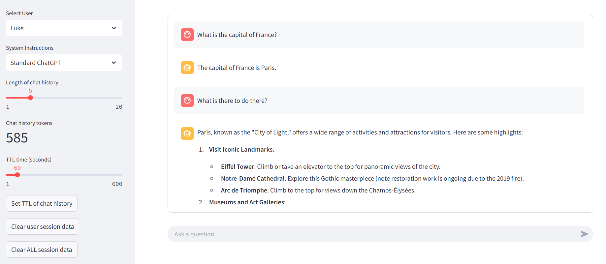

# Use Azure Managed Redis to store LLM chat history

A [streamlit](https://github.com/streamlit/streamlit)-based web app writen in Python and using Azure Managed Redis and Azure OpenAI service to create a simple multi-user chatbot with chat memory.
 
## Features

This project contains several features that build on a basic chatbot example. These features include:

* Multiple users, each with their own chat memory and settings. 
* Running calculation of tokens contained in the stored chat memory
* Ability to select the last `n` messages to trim the chat memory context
* Ability to set a time-to-live (TTL) for chat memory, unique to each user
* Configurable system instructions to change how the LLM responds to questions

<div> </div>

## Architecture

The example uses three Azure components:
1. **Azure App Service** to host the application.
2. **Azure OpenAI Service** to deploy an LLM (in this case, GPT-4o) to respond to user queries.
3. **Azure Managed Redis** to store the chat history, set TTL, and hold other configurable system information.

The secret sauce of this example is using Redis, which is extremely flexible and ideal for these types of use-cases. We are also using the wonderful [RedisVL library](https://docs.redisvl.com/en/latest/) to make plugging Redis in easy. 
[Azure Managed Redis](https://learn.microsoft.com/azure/azure-cache-for-redis/managed-redis/managed-redis-overview) is the newest managed Redis service on Azure and offers everything we need from Redis as a managed offering at a very attractive price. 

## Getting Started

### Prerequisites

- Azure subscription. [Start free](https://azure.microsoft.com/free)
- Azure Developer CLI. [Install](https://learn.microsoft.com/azure/developer/azure-developer-cli/install-azd?tabs=winget-windows%2Cbrew-mac%2Cscript-linux&pivots=os-windows)

### Deploy the project using the Azure Developer CLI
The Azure Developer CLI (AZD) is a super useful tool to provision resources and code on Azure with minimal fuss. Follow these instructions to get going: 

1. Clone the repository and change to the main project folder, where the azure.yaml file is located:
   ```
   git clone https://github.com/redis-developer/redis-rag-workbench.git
   cd redis-rag-workbench
   ```
1. Run:
    ```
    azd up
    ```
1. Follow command prompt to enter environment name and select subscription
1. This will create all the resources needed to run the sample:
  - Azure App Services Web App
  - Azure OpenAI Service
  - Azure Managed Redis
5. AZD will also deploy the code to the App Services instance. Once it has completed, open the Default domain (e.g. <yourappname>.azurewebsites.net) and the app should be running!

### Cleaning Up Resources
To clean up the environment, run 
    ```
    azd down
    ```
